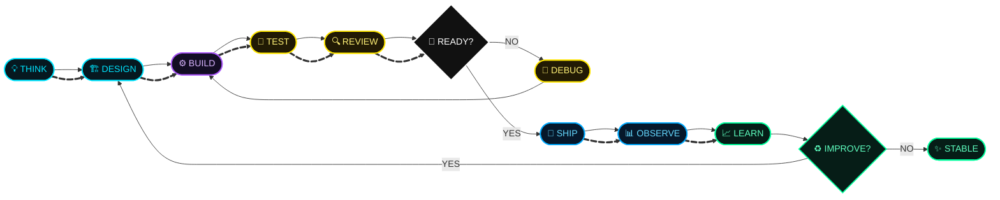
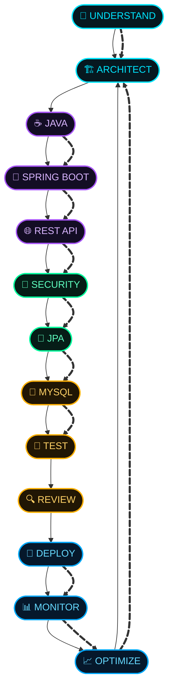

<p align="center">
  
</p>

<p align="center">
  
</p>

<p align="center">
  
  
  
  
</p>

<p align="center">
  <a href="https://github.com/UltraProXDev">
    
  </a>
  
</p>

---


## `01` // DEVELOPER PROFILE

<table>
<tr>
<td width="58%" valign="top">

### 👋 Hi, I'm UltraProXDev

I'm an aspiring **Java Backend Developer** focused on designing and building structured, secure and maintainable backend applications.

My current engineering path is centered around the **Spring ecosystem**, database-driven applications and RESTful API development.

```text
┌──────────────────────────────────────────────────────────┐
│                  BACKEND ENGINEERING                     │
├──────────────────────────────────────────────────────────┤
│                                                          │
│  ☕ Java              ████████████████████░░  Learning   │
│  🌱 Spring Boot       ██████████████████░░░░  Building   │
│  🔐 Spring Security   ███████████████░░░░░░  Learning    │
│  🌐 REST APIs         ███████████████████░░░  Building   │
│  🗃️ JPA / Hibernate   ██████████████████░░░░  Building   │
│  🐬 MySQL             ███████████████████░░░  Building   │
│  🧠 DSA               ███████████████░░░░░░░  Improving  │
│  🏗️ System Design     ███████████░░░░░░░░░░░  Exploring  │
│                                                          │
└──────────────────────────────────────────────────────────┘
```

</td>

<td width="42%" valign="top">

### ⚡ Engineering Mindset

```text
       THINK
         │
         ▼
      DESIGN
         │
         ▼
       BUILD
         │
         ▼
       TEST
         │
         ▼
       DEBUG
         │
         ▼
      IMPROVE
         │
         └──────────────┐
                        │
                        ▼
                     REPEAT
```

<br>

> **Understand the problem.
> Design the solution.
> Write clean code.
> Test everything.
> Improve continuously.**

</td>
</tr>
</table>

---

## `02` // TECHNOLOGY UNIVERSE

### ☕ Core Backend Stack

<p align="center">
  
</p>

<p align="center">
  
  
  
  
</p>

<p align="center">
  
  
  
  
</p>

### 🗄️ Database & Persistence

<p align="center">
  
</p>

```text
DATABASE
│
├── MySQL
├── SQL
├── Relational Modeling
├── Entity Relationships
├── CRUD Operations
├── JPA
├── Hibernate ORM
├── Querying
├── Persistence
└── Transaction Concepts
```

### 🧪 API & Development Tools

<p align="center">
  
</p>

<p>


</p>

| Tool            | Role                                          |
| --------------- | --------------------------------------------- |
| `IntelliJ IDEA` | Primary Java / Spring IDE                     |
| `Eclipse`       | Java development & experimentation            |
| `Postman`       | REST API testing                              |
| `Git`           | Version control                               |
| `GitHub`        | Source control & collaboration                |
| `Maven`         | Java build & dependency management            |
| `VS Code`       | Configuration, Markdown & lightweight editing |
| `Linux`         | Development environment                       |
| `Docker`        | Containerization & deployment exploration     |

---

# `03` // BACKEND ARCHITECTURE

<p align="center">

```text
                         ┌───────────────────────┐
                         │       CLIENT          │
                         │ Web / Mobile / API    │
                         └───────────┬───────────┘
                                     │
                                     │ HTTP
                                     ▼
                    ╔══════════════════════════════╗
                    ║        REST CONTROLLER       ║
                    ║     Spring MVC / REST API    ║
                    ╚══════════════╤═══════════════╝
                                   │
                                   ▼
                    ╔══════════════════════════════╗
                    ║          SERVICE             ║
                    ║       Business Logic         ║
                    ╚══════════════╤═══════════════╝
                                   │
                                   ▼
                    ╔══════════════════════════════╗
                    ║        REPOSITORY            ║
                    ║      Spring Data JPA         ║
                    ╚══════════════╤═══════════════╝
                                   │
                                   ▼
                    ╔══════════════════════════════╗
                    ║          HIBERNATE           ║
                    ║             ORM              ║
                    ╚══════════════╤═══════════════╝
                                   │
                                   ▼
                    ╔══════════════════════════════╗
                    ║            MYSQL             ║
                    ║         DATABASE             ║
                    ╚══════════════════════════════╝
```

</p>

### 📦 Typical Project Structure

```text
src/
└── main/
    ├── java/
    │   └── com.ultraproxdev/
    │       │
    │       ├── controller/
    │       │   └── REST endpoints
    │       │
    │       ├── service/
    │       │   └── Business logic
    │       │
    │       ├── repository/
    │       │   └── JPA repositories
    │       │
    │       ├── entity/
    │       │   └── Database entities
    │       │
    │       ├── dto/
    │       │   └── Request / Response models
    │       │
    │       ├── exception/
    │       │   └── Exception handling
    │       │
    │       ├── config/
    │       │   └── Application configuration
    │       │
    │       └── Application.java
    │
    └── resources/
        ├── application.properties
        └── static/
```

---

# `04` // REQUEST → RESPONSE PIPELINE

```text
┌──────────────┐
│    CLIENT    │
└──────┬───────┘
       │
       │ HTTP Request
       ▼
┌──────────────┐
│  CONTROLLER  │
└──────┬───────┘
       │
       │ Validate / Route
       ▼
┌──────────────┐
│   SERVICE    │
└──────┬───────┘
       │
       │ Business Logic
       ▼
┌──────────────┐
│  REPOSITORY  │
└──────┬───────┘
       │
       │ JPA / Hibernate
       ▼
┌──────────────┐
│    MYSQL     │
└──────┬───────┘
       │
       │ Result
       ▼
┌──────────────┐
│   SERVICE    │
└──────┬───────┘
       │
       ▼
┌──────────────┐
│  CONTROLLER  │
└──────┬───────┘
       │
       │ JSON Response
       ▼
┌──────────────┐
│    CLIENT    │
└──────────────┘
```

---

# `05` // FEATURED PROJECT

## 🏢 Company Management System

<p align="center">
  
</p>

<p align="center">
  <a href="https://github.com/UltraProXDev/Company-Management-System">
    
  </a>
</p>

### 🔎 Project Overview

A backend-oriented **Company Management System** built around the Spring ecosystem and database-driven application development.

The project represents my practical implementation of:

```text
                  COMPANY MANAGEMENT SYSTEM
                            │
             ┌──────────────┼──────────────┐
             ▼              ▼              ▼
          BUSINESS       DATABASE         API
           LOGIC          LAYER          LAYER
             │              │              │
             ▼              ▼              ▼
         SERVICES       MYSQL/JPA       REST API
             │              │              │
             └──────────────┼──────────────┘
                            ▼
                    SPRING BOOT APP
```

### 🧰 Project Stack

<p align="center">
  
  
  
  
  
  
  
  
</p>

### 🔧 Concepts

```text
✓ Spring Boot application structure
✓ REST API development
✓ CRUD operations
✓ Controller layer
✓ Service layer
✓ Repository layer
✓ Spring Data JPA
✓ Hibernate ORM
✓ MySQL integration
✓ Entity mapping
✓ Dependency Injection
✓ Maven dependency management
✓ API testing with Postman
```

---

# `06` // API ENGINEERING

```text
                  REST API DESIGN
                        │
       ┌────────────────┼────────────────┐
       ▼                ▼                ▼
     CREATE           READ             UPDATE
       │                │                │
     POST             GET              PUT/PATCH
       │                │                │
       └────────────────┼────────────────┘
                        │
                        ▼
                     DELETE
                        │
                       DELETE
```

### 🔌 API Principles

| Layer      | Responsibility                 |
| ---------- | ------------------------------ |
| Controller | HTTP requests / responses      |
| Service    | Business rules                 |
| Repository | Persistence                    |
| Entity     | Domain/database representation |
| DTO        | API contract                   |
| Exception  | Error handling                 |
| Security   | Authentication / authorization |
| Database   | Persistent storage             |

---

# `07` // SECURITY ROADMAP

```text
                 🔐 APPLICATION SECURITY
                          │
             ┌────────────┼────────────┐
             ▼            ▼            ▼
        AUTHENTICATION AUTHORIZATION VALIDATION
             │            │            │
             ▼            ▼            ▼
          JWT /        ROLES /       INPUT /
          LOGIN        PERMISSIONS   REQUEST
             │            │            │
             └────────────┼────────────┘
                          ▼
                  SECURE REST API
```

### Currently Exploring

* Spring Security
* Authentication
* Authorization
* Role-based access
* JWT
* Password security
* Endpoint protection
* Request validation
* Exception handling

---

# `08` // AI-ASSISTED ENGINEERING

> AI is part of my toolbox — fundamentals, architecture and final decisions remain my responsibility.

<p align="center">
  
  
  
  
</p>

<p align="center">
  
  
  
  
</p>

### 🧠 AI Workflow

```text
                 ┌──────────────────┐
                 │      PROBLEM     │
                 └────────┬─────────┘
                          ▼
                 ┌──────────────────┐
                 │    RESEARCH      │
                 └────────┬─────────┘
                          ▼
                 ┌──────────────────┐
                 │   AI ASSISTANCE  │
                 │                  │
                 │ ChatGPT          │
                 │ Claude           │
                 │ Gemini           │
                 │ Copilot          │
                 │ Perplexity       │
                 └────────┬─────────┘
                          ▼
                 ┌──────────────────┐
                 │ HUMAN REVIEW     │
                 │ UNDERSTAND CODE  │
                 └────────┬─────────┘
                          ▼
                 ┌──────────────────┐
                 │   IMPLEMENT      │
                 └────────┬─────────┘
                          ▼
                 ┌──────────────────┐
                 │ TEST / DEBUG     │
                 └────────┬─────────┘
                          ▼
                    🚀 SHIP
```

---

# `09` // CURRENT LEARNING SYSTEM

```text
                    ┌───────────────┐
                    │  JAVA CORE    │
                    └───────┬───────┘
                            │
              ┌─────────────┼─────────────┐
              ▼             ▼             ▼
           SPRING        DATABASE        DSA
              │             │             │
              ▼             ▼             ▼
        SPRING BOOT       MYSQL       ALGORITHMS
              │             │             │
              ▼             ▼             ▼
        REST APIs          JPA        PROBLEM
              │          HIBERNATE     SOLVING
              │             │             │
              └─────────────┼─────────────┘
                            ▼
                     BACKEND SYSTEMS
                            │
                            ▼
                     SYSTEM DESIGN
                            │
                            ▼
                      DEPLOYMENT
```

### 🟢 Current

* Advanced Java
* Spring Framework
* Spring Boot
* Spring Security
* REST API development
* JPA
* Hibernate
* MySQL
* CRUD operations
* DSA
* Backend architecture

### 🔵 Next

* JWT authentication
* Role-based authorization
* DTO architecture
* Validation
* Global exception handling
* Pagination
* Sorting
* API documentation
* Docker
* CI/CD
* Redis
* Microservices
* Cloud deployment
* Advanced system design

---

# `10` // GITHUB ANALYTICS

<p align="center">
  
  
</p>

<p align="center">
  
</p>

---

## 🧪 My Development Workflow

> **Think → Architect → Engineer → Validate → Ship → Observe → Evolve**

```mermaid
flowchart TB

    %% ==========================================================
    %% 01 — DISCOVERY
    %% ==========================================================

    A([💡 IDEA]) --> B[🔎 RESEARCH]
    B --> C[📋 REQUIREMENTS]
    C --> D{🎯 PROBLEM<br/>DEFINED?}

    D -->|❌ NO| B
    D -->|✅ YES| E[🧠 SYSTEM THINKING]

    %% ==========================================================
    %% 02 — ARCHITECTURE
    %% ==========================================================

    E --> F{{🏗️ ARCHITECTURE}}

    F --> G[🌐 API DESIGN]
    F --> H[🗄️ DATA MODEL]
    F --> I[🔐 SECURITY MODEL]
    F --> J[📦 PROJECT STRUCTURE]

    G --> K[🧩 COMPONENT DESIGN]
    H --> K
    I --> K
    J --> K

    K --> L{⚖️ DESIGN<br/>VALIDATED?}

    L -->|❌ REWORK| E
    L -->|✅ READY| M[⚙️ IMPLEMENTATION]

    %% ==========================================================
    %% 03 — ENGINEERING
    %% ==========================================================

    M --> N[☕ JAVA]
    N --> O[🌱 SPRING BOOT]

    O --> P[🎯 CONTROLLER]
    P --> Q[🧠 SERVICE]
    Q --> R[🗃️ REPOSITORY]
    R --> S[🧩 JPA / HIBERNATE]
    S --> T[(🐬 MYSQL)]

    %% ==========================================================
    %% 04 — API + SECURITY
    %% ==========================================================

    O --> U[🔐 SPRING SECURITY]
    U --> V[🛡️ AUTHENTICATION]
    V --> W[🔑 AUTHORIZATION]

    W --> P

    %% ==========================================================
    %% 05 — VALIDATION
    %% ==========================================================

    T --> X[🧪 INTEGRATION TEST]
    P --> X
    W --> X

    X --> Y[📮 POSTMAN]
    Y --> Z{🔍 TESTS<br/>PASS?}

    Z -->|❌ FAIL| AA[🐛 DEBUG]
    AA --> M

    Z -->|✅ PASS| AB[🔍 CODE REVIEW]

    %% ==========================================================
    %% 06 — DELIVERY
    %% ==========================================================

    AB --> AC{🚦 PRODUCTION<br/>READY?}

    AC -->|❌ NO| AD[♻️ REFACTOR]
    AD --> M

    AC -->|✅ YES| AE[📦 BUILD]
    AE --> AF[🚀 DEPLOY]

    %% ==========================================================
    %% 07 — OBSERVABILITY
    %% ==========================================================

    AF --> AG[📊 MONITOR]
    AG --> AH[📈 MEASURE]
    AH --> AI{⚡ OPTIMIZE?}

    AI -->|🚀 PERFORMANCE| AJ[⚡ OPTIMIZE]
    AI -->|🔐 SECURITY| AK[🛡️ HARDEN]
    AI -->|📈 SCALE| AL[🌐 SCALE]
    AI -->|✨ FEATURES| AM[🧩 EVOLVE]

    AJ --> E
    AK --> E
    AL --> E
    AM --> E

    %% ==========================================================
    %% ANIMATED EDGES
    %% ==========================================================

    A e1@==> B
    e1@{ animation: fast }

    B e2@==> C
    e2@{ animation: fast }

    E e3@==> F
    e3@{ animation: slow }

    F e4@==> K
    e4@{ animation: slow }

    K e5@==> M
    e5@{ animation: fast }

    M e6@==> O
    e6@{ animation: fast }

    O e7@==> P
    e7@{ animation: fast }

    Q e8@==> R
    e8@{ animation: slow }

    R e9@==> S
    e9@{ animation: slow }

    S e10@==> T
    e10@{ animation: fast }

    T e11@==> X
    e11@{ animation: fast }

    X e12@==> Y
    e12@{ animation: fast }

    AB e13@==> AE
    e13@{ animation: fast }

    AE e14@==> AF
    e14@{ animation: fast }

    AF e15@==> AG
    e15@{ animation: slow }

    AG e16@==> AH
    e16@{ animation: slow }

    AH e17@==> AI
    e17@{ animation: slow }

    %% ==========================================================
    %% NEON THEME
    %% ==========================================================

    classDef idea fill:#06141d,stroke:#00e5ff,color:#00e5ff,stroke-width:2px;
    classDef research fill:#0a1622,stroke:#38bdf8,color:#7dd3fc,stroke-width:2px;
    classDef architecture fill:#110d24,stroke:#a855f7,color:#d8b4fe,stroke-width:2px;
    classDef engineering fill:#061d17,stroke:#00ff9d,color:#5fffc0,stroke-width:2px;
    classDef database fill:#211604,stroke:#ffb000,color:#ffd166,stroke-width:2px;
    classDef security fill:#230817,stroke:#ff3b81,color:#ff7aa8,stroke-width:2px;
    classDef testing fill:#1c1704,stroke:#ffe600,color:#fff176,stroke-width:2px;
    classDef deployment fill:#06182b,stroke:#00aaff,color:#66d9ff,stroke-width:2px;
    classDef monitor fill:#0d1426,stroke:#6366f1,color:#a5b4fc,stroke-width:2px;
    classDef decision fill:#111111,stroke:#ffffff,color:#ffffff,stroke-width:2px;

    class A idea;
    class B,C research;
    class E,F,G,H,I,J,K,L architecture;
    class M,N,O,P,Q,R,S engineering;
    class T database;
    class U,V,W security;
    class X,Y,Z,AA,AB testing;
    class AC,AD,AE,AF deployment;
    class AG,AH,AI,AJ,AK,AL,AM monitor;
    class D,L,Z,AC,AI decision;
```



### 🧬 The Engineering Loop



### 🌐 Backend Request Journey

```mermaid
flowchart LR

    CLIENT([👤 CLIENT])
    --> REQUEST[🌐 HTTP REQUEST]

    REQUEST
    --> SECURITY[🔐 SPRING SECURITY]

    SECURITY
    --> AUTH{🛡️ AUTHORIZED?}

    AUTH -->|❌| DENIED[🚫 401 / 403]
    AUTH -->|✅| CONTROLLER[🎯 REST CONTROLLER]

    CONTROLLER
    --> VALIDATE[✅ VALIDATION]

    VALIDATE
    --> SERVICE[🧠 SERVICE LAYER]

    SERVICE
    --> REPOSITORY[🗃️ REPOSITORY]

    REPOSITORY
    --> ORM[🧩 JPA / HIBERNATE]

    ORM
    --> DATABASE[(🐬 MYSQL)]

    DATABASE
    --> ORM
    --> REPOSITORY
    --> SERVICE
    --> RESPONSE[📦 DTO / JSON]

    RESPONSE
    --> CLIENT

    %% Animated data path

    REQUEST r1@==> SECURITY
    r1@{ animation: fast }

    SECURITY r2@==> CONTROLLER
    r2@{ animation: fast }

    CONTROLLER r3@==> SERVICE
    r3@{ animation: fast }

    SERVICE r4@==> REPOSITORY
    r4@{ animation: slow }

    REPOSITORY r5@==> ORM
    r5@{ animation: slow }

    ORM r6@==> DATABASE
    r6@{ animation: fast }

    DATABASE r7@==> RESPONSE
    r7@{ animation: fast }

    RESPONSE r8@==> CLIENT
    r8@{ animation: fast }

    %% Styles

    classDef client fill:#061820,stroke:#00e5ff,color:#00e5ff,stroke-width:2px;
    classDef security fill:#230817,stroke:#ff3b81,color:#ff7aa8,stroke-width:2px;
    classDef backend fill:#130d24,stroke:#a855f7,color:#d8b4fe,stroke-width:2px;
    classDef database fill:#211604,stroke:#ffb000,color:#ffd166,stroke-width:2px;
    classDef response fill:#061d17,stroke:#00ff9d,color:#5fffc0,stroke-width:2px;
    classDef decision fill:#111111,stroke:#ffffff,color:#ffffff,stroke-width:2px;

    class CLIENT,REQUEST client;
    class SECURITY,DENIED security;
    class CONTROLLER,VALIDATE,SERVICE,REPOSITORY,ORM backend;
    class DATABASE database;
    class RESPONSE response;
    class AUTH decision;
```



### ⚡ My Backend Philosophy



---

# `11` // DEVELOPMENT WORKFLOW

```text
       ┌─────────────────────────┐
       │       💡 IDEA           │
       └────────────┬────────────┘
                    ▼
       ┌─────────────────────────┐
       │      🔎 RESEARCH        │
       └────────────┬────────────┘
                    ▼
       ┌─────────────────────────┐
       │      🧠 DESIGN          │
       └────────────┬────────────┘
                    ▼
       ┌─────────────────────────┐
       │      💻 IMPLEMENT       │
       └────────────┬────────────┘
                    ▼
       ┌─────────────────────────┐
       │       🧪 TEST           │
       └────────────┬────────────┘
                    ▼
       ┌─────────────────────────┐
       │      🔍 REVIEW          │
       └────────────┬────────────┘
                    ▼
       ┌─────────────────────────┐
       │       🚀 DEPLOY         │
       └────────────┬────────────┘
                    ▼
       ┌─────────────────────────┐
       │       📈 IMPROVE        │
       └────────────┬────────────┘
                    │
                    └──────────► REPEAT
```

---

# `12` // ENGINEERING PRINCIPLES

<table>
<tr>
<td align="center" width="25%">

### 🧠

**UNDERSTAND**

Understand the problem before writing code.

</td>

<td align="center" width="25%">

### 🧱

**DESIGN**

Structure systems before implementing them.

</td>

<td align="center" width="25%">

### 🧪

**TEST**

Verify behavior instead of assuming it works.

</td>

<td align="center" width="25%">

### 📈

**IMPROVE**

Refactor, optimize and keep learning.

</td>
</tr>
</table>

---

# `13` // 2026 ROADMAP

```text
                         2026
                          │
        ┌─────────────────┼─────────────────┐
        │                 │                 │
        ▼                 ▼                 ▼
      JAVA             SPRING             DSA
        │                 │                 │
        ▼                 ▼                 ▼
      OOP            SPRING BOOT       ALGORITHMS
        │                 │                 │
        ▼                 ▼                 ▼
     ADVANCED         SECURITY          PROBLEM
       JAVA             JWT              SOLVING
        │                 │                 │
        └─────────────────┼─────────────────┘
                          │
                          ▼
                    BACKEND SYSTEMS
                          │
                          ▼
                    SYSTEM DESIGN
                          │
                          ▼
                     DOCKER / CI
                          │
                          ▼
                     CLOUD / AWS
                          │
                          ▼
                  🚀 PRODUCTION READY
```

---

# `14` // CONNECT

<p align="center">

<a href="https://github.com/UltraProXDev">
  
</a>

<a href="https://www.linkedin.com/">
  
</a>

</p>

---

<p align="center">
  
</p>

<p align="center">
  
</p>

<p align="center">
  <b>⚡ Code with purpose · Build with discipline · Learn continuously</b>
</p>

<p align="center">
  <sub>© 2026 UltraProXDev</sub>
</p>

