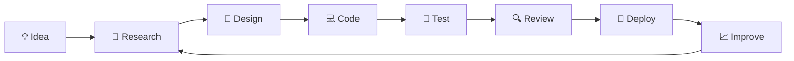

# 👋 Hi, I'm **Your Name**

### 🚀 Aspiring Software Developer • Problem Solver • Lifelong Learner

<p align="center">
  
</p>

<p align="center">
  
</p>

<p align="center">
  <a href="https://github.com/YOUR_USERNAME">
    
  </a>
  <a href="https://github.com/YOUR_USERNAME?tab=followers">
    
  </a>
</p>

---

## 🧑‍💻 About Me

I'm an **aspiring software developer** passionate about understanding how things work under the hood and turning ideas into clean, maintainable software.

My current journey revolves around:

```text
┌─────────────────────────────────────────────────────────────┐
│                                                             │
│   🧠 Problem Solving       → Algorithms & Data Structures  │
│   ☕ Java                  → OOP & Advanced Java            │
│   🐍 Python               → Automation & Backend           │
│   ⚡ C++                  → Competitive Programming        │
│   🏗️ System Design        → Scalable Architecture          │
│   🔧 Software Engineering  → Clean & Maintainable Code     │
│                                                             │
└─────────────────────────────────────────────────────────────┘
```

> **"Don't just write code. Understand the problem, design the solution, and build something that lasts."**

---

# ⚡ Tech Stack

### 💻 Programming Languages

<p>
  
</p>

### 🧠 Core Concepts

<p>
  
  
  
  
  
</p>

### 🛠️ Tools & Technologies

<p>
  
</p>

---

# 🚀 What I'm Working On

<table>
<tr>
<td width="50%">

### 🧩 Data Structures & Algorithms

* Arrays & Strings
* Linked Lists
* Stacks & Queues
* Trees & Graphs
* Hashing
* Recursion & Backtracking
* Dynamic Programming
* Searching & Sorting
* Graph Algorithms

</td>

<td width="50%">

### 🏗️ Software Engineering

* Advanced Java
* Advanced Python
* Backend fundamentals
* REST API concepts
* Database fundamentals
* System design basics
* Git & GitHub workflows
* Clean code principles

</td>
</tr>
</table>

---

# 🌱 Currently Learning

```text
                    MY LEARNING ROADMAP

                         ┌───────────┐
                         │   CORE    │
                         │ PROGRAMMING│
                         └─────┬─────┘
                               │
                ┌──────────────┼──────────────┐
                ▼              ▼              ▼
          ┌──────────┐   ┌──────────┐   ┌──────────┐
          │   DSA    │   │   JAVA   │   │  PYTHON  │
          └────┬─────┘   └────┬─────┘   └────┬─────┘
               │              │              │
               └──────────────┼──────────────┘
                              ▼
                     ┌────────────────┐
                     │   BACKEND DEV  │
                     └───────┬────────┘
                             │
                             ▼
                     ┌────────────────┐
                     │ SYSTEM DESIGN  │
                     └───────┬────────┘
                             │
                             ▼
                     ┌────────────────┐
                     │ BUILD PROJECTS │
                     └────────────────┘
```

### 🎯 2026 Goals

* [ ] Master advanced Data Structures & Algorithms
* [ ] Improve competitive programming skills
* [ ] Build production-quality backend projects
* [ ] Strengthen Java & Python fundamentals
* [ ] Learn scalable system design
* [ ] Contribute to open-source projects
* [ ] Build and deploy real-world applications
* [ ] Maintain consistent GitHub contributions

---

# 📊 GitHub Analytics

<p align="center">
  
  
</p>

<p align="center">
  
</p>

---

# 📈 Contribution Graph

<p align="center">
  
</p>

---

# 🏆 GitHub Achievements

<p align="center">
  
</p>

---

# 💻 Coding Philosophy

<table>
<tr>
<td align="center">🧠<br><b>Understand</b><br><sub>Understand the problem first.</sub></td>
<td align="center">🧩<br><b>Design</b><br><sub>Think before writing code.</sub></td>
<td align="center">⚙️<br><b>Build</b><br><sub>Turn ideas into working software.</sub></td>
<td align="center">🔍<br><b>Improve</b><br><sub>Refactor, optimize, learn.</sub></td>
</tr>
</table>

---

# 🚀 Featured Projects

> Replace these with your best repositories.

<table>
<tr>
<td width="50%">

### 🔥 Project One

**A practical project demonstrating problem solving, clean architecture, and modern development practices.**

`Java` `DSA` `OOP`

<a href="https://github.com/YOUR_USERNAME/PROJECT_ONE">

</a>

</td>

<td width="50%">

### ⚡ Project Two

**A Python-based project focused on automation, backend concepts, or real-world problem solving.**

`Python` `Backend` `API`

<a href="https://github.com/YOUR_USERNAME/PROJECT_TWO">

</a>

</td>
</tr>

<tr>
<td width="50%">

### 🧠 Project Three

**A data-structures or algorithm-focused project built to strengthen core computer science concepts.**

`C++` `Algorithms` `DSA`

<a href="https://github.com/YOUR_USERNAME/PROJECT_THREE">

</a>

</td>

<td width="50%">

### 🏗️ Project Four

**An evolving project where I experiment with architecture, databases, APIs, and scalable software design.**

`Java` `SQL` `Backend`

<a href="https://github.com/YOUR_USERNAME/PROJECT_FOUR">

</a>

</td>
</tr>
</table>

---

# 🧪 My Development Workflow



---

# 📚 Currently Exploring

| Area                  | What I'm Learning                                   |
| --------------------- | --------------------------------------------------- |
| 🧠 **DSA**            | Advanced algorithms, optimization & problem solving |
| ☕ **Java**            | Advanced Java, OOP & backend development            |
| 🐍 **Python**         | Backend development, automation & scripting         |
| ⚡ **C++**             | Competitive programming & performance               |
| 🏗️ **System Design** | Scalability, architecture & design patterns         |
| 🗄️ **Databases**     | SQL, data modeling & database fundamentals          |
| 🌐 **Backend**        | APIs, services & server-side development            |
| 🔧 **Git**            | Version control & collaborative development         |

---

# 🎯 Developer Journey

```text
Beginner
   │
   ▼
Programming Fundamentals
   │
   ▼
Data Structures & Algorithms
   │
   ▼
Object-Oriented Programming
   │
   ▼
Advanced Java / Python / C++
   │
   ▼
Backend Development
   │
   ▼
System Design
   │
   ▼
Real-World Projects
   │
   ▼
Open Source
   │
   ▼
🚀 Professional Software Developer
```

---

# 🌐 Connect With Me

<p align="center">

<a href="https://github.com/YOUR_USERNAME">

</a>

<a href="https://www.linkedin.com/in/YOUR_LINKEDIN/">

</a>

<a href="mailto:[YOUR_EMAIL@example.com](mailto:YOUR_EMAIL@example.com)">

</a>

</p>

---

# 💬 Developer Quote

<p align="center">
  <i>"First, solve the problem. Then, write the code."</i>
</p>

---

<p align="center">
  
</p>

<p align="center">
  <b>⭐ If you find my projects interesting, consider giving them a star!</b>
</p>

<p align="center">
  <sub>Built with curiosity • Driven by learning • Powered by code</sub>
</p>
